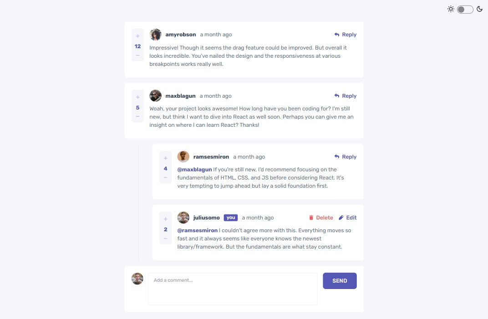
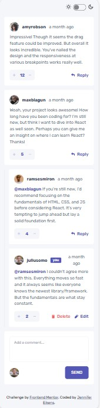

# Frontend Mentor - Interactive comments section solution

This is a solution to the [Interactive comments section challenge on Frontend Mentor](https://www.frontendmentor.io/challenges/interactive-comments-section-iG1RugEG9). Frontend Mentor challenges help you improve your coding skills by building realistic projects.

## Table of contents

- [Overview](#overview)
  - [The challenge](#the-challenge)
  - [Screenshot](#screenshot)
  - [Links](#links)
- [My process](#my-process)
  - [Built with](#built-with)
  - [What I learned](#what-i-learned)
  - [Continued development](#continued-development)
- [Author](#author)

## Overview

### The challenge

Users should be able to:

- View the optimal layout for the app depending on their device's screen size
- See hover states for all interactive elements on the page
- Create, Read, Update, and Delete comments and replies
- Upvote and downvote comments
- **Bonus**: If you're building a purely front-end project, use `localStorage` to save the current state in the browser that persists when the browser is refreshed.
- **Bonus**: Instead of using the `createdAt` strings from the `data.json` file, try using timestamps and dynamically track the time since the comment or reply was posted.

### Screenshot

### Links

- Solution URL: [Add solution URL here](https://your-solution-url.com)
- Live Site URL: [Add live site URL here](https://your-live-site-url.com)

## My process

### Built with

- Semantic HTML5 markup
- CSS custom properties
- Typescript
- Flexbox
- CSS Grid
- Mobile-first workflow
- [React](https://reactjs.org/) - JS library
- [Next.js](https://nextjs.org/) - React framework
- [TailwindCSS](https://tailwindcss.com/) - CSS framework
- [DaisyUI](https://daisyui.com/) - TailwindCSS component library

### What I learned

Oh boy, what didn't I learn during this project? :sweat_smile:
This is my first project built with Next.js. Having previously used React, I decided I wanted to work with Next moving forward (for SEO and performance optimization - and also to be able to build multi-page apps in the future). I took some time to learn about Next, and it definitely took some getting used no longer having the src folder I was used to, working with the App Router, understanding the pages system etc. I also needed to take some time to learn about different rendering options and figure out how to combine server- and client-side rendering in my project to have both SEO and fast loading as well as interactivity.

This project required the most JavaScript by far out of all the projects I've done so far. Figuring out all the necessary functionalities and writing functions accordingly certainly was no easy feat for me, but it was a valuable learning experience for sure. I'm also fairly new to data fetching / working with APIs (although obviously in this case the data came from a static file).

I had to make some decisions regarding what the different components control and what functionalities should or shouldn't be centralized in the parent component, which required me to consider this topic in a lot more detail than I had previously done.

I also had never heard of recursion before but as it turned out, I needed it for quite a few of my functions (to make it possible to traverse nested replies). This was definitely one of the biggest (and most challenging) learning experiences of this project for me, and I'm still not sure I fully understand it :sweat_smile:

Lastly, I implemented a dark mode for the first time. I defined my own custom themes and used a theme controller provided by DaisyUI.

### Continued development

I have a lot more to learn about Next.js (especially seeing as this project was only a single-page app, so no setting up multiple pages and no routing were involved). Also, I'm afraid I'll have to look into recursion a bit more in the future.

## Author

- Website - [Jennifer Eikens](https://jenny-eikens.github.io/portfolio-page/#projects)
- Frontend Mentor - [@Jenny-Eikens](https://www.frontendmentor.io/profile/Jenny-Eikens)
- GitHub - [Jenny-Eikens](https://github.com/Jenny-Eikens)
